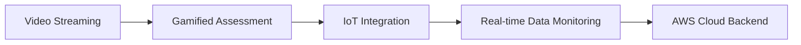

```markdown
<h1 align="center">
  
```text
  ______   __                              __            __       __           
 /      \ |  \                            |  \          |  \     /  \          
|  $$$$$$\| $$____    ______   __    __  _| $$_         | $$\   /  $$  ______  
| $$__| $$| $$    \  /      \ |  \  |  \|   $$ \        | $$$\ /  $$$ /      \ 
| $$    $$| $$$$$$$\|  $$$$$$\| $$  | $$ \$$$$$$        | $$$$\  $$$$|  $$$$$$\
| $$$$$$$$| $$  | $$| $$  | $$| $$  | $$  | $$ __       | $$\$$ $$ $$| $$    $$
| $$  | $$| $$__/ $$| $$__/ $$| $$__/ $$  | $$|  \      | $$ \$$$| $$| $$$$$$$$
| $$  | $$| $$    $$ \$$    $$ \$$    $$   \$$  $$      | $$  \$ | $$ \$$     \
 \$$   \$$ \$$$$$$$   \$$$$$$   \$$$$$$     \$$$$        \$$      \$$  \$$$$$$$
```

</h1>

<h3 align="center">🎓 Computer Engineer | 🧮 Mathematician | 📊 Data Engineering Specialist</h3>
<p align="center">
  <em>Bridging Software Architecture with Inclusive Education & Data Science</em>
</p>

<p align="center">
  <a href="https://www.linkedin.com/in/lucaslopes-ti/" target="_blank">
    
  </a>
  <a href="mailto:lucas.dalps@gmail.com">
    
  </a>
  <a href="https://exataslibras.com.br" target="_blank">
    
  </a>
</p>

---

## 👨‍💻 Professional Summary

```ascii
  ,-.       _,---._ __  / \                                          /\___/\
 /  )    .-'       `./ /   \                                        )     (
(  (   ,'            `/    /|                                       =\   /=
 \  `-'             \'\   / |    Focus: Assistive Technology         )   (
  `.              ,  \ \ /  |           Educational Software        /     \
   /`.          ,'-`----Y   |           Data Engineering           )     (
  (            ;        |   '                                      /       \
  |  ,-.    ,-'         |  /                                       \       /
  |  | (   |            | /                                         \__ __/
  )  |  \  `.___________|/                                             ))
  `--'   `--'                                                           //
```

Dual-background professional with degrees in **Computer Engineering** and **Mathematics**, specializing in **Data Science & Big Data** (PUC Minas). My work bridges software architecture and inclusive education, with specific focus on developing technical solutions for the **Deaf community (Libras)**.

I combine rigorous mathematical modeling with software engineering principles to build **scalable educational platforms**, **IoT monitoring systems**, and **data-driven learning environments**.

---

## 🎯 Current Focus

- 🔬 **Data Engineering:** Optimizing ETL pipelines and data lakes using AWS ecosystems
- ♿ **Accessible Tech:** Developing AI-driven interfaces for sign language recognition
- 🏗️ **Software Architecture:** Implementing Clean Architecture patterns in .NET and Python
- 🎮 **Game-Based Learning:** Creating educational game engines in Unity and Godot

---

## 🛠️ Technical Stack

<table>
<tr>
<td valign="top" width="50%">

### Core Development
```python
languages = {
    "Primary": ["C#", "Python", "Java"],
    "Systems": ["C", "C++"],
    "Web": ["JavaScript", "TypeScript"],
    "Game": ["GDScript", "C#"]
}
```

### Data & Cloud
- **AWS:** Glue, Athena, S3, Redshift, EMR
- **Analytics:** Pandas, Power BI, SQL
- **Databases:** PostgreSQL, SQL Server, SQLite

</td>
<td valign="top" width="50%">

### Frameworks & Platforms
- **Backend:** ASP.NET, Django, Flask
- **Frontend:** Angular, HTML5/CSS3
- **Game Engines:** Unity, Godot, UPBGE
- **IoT:** ESP32, Arduino, Sensor Networks
- **CMS:** WordPress (Custom Development)

### DevOps & Tools
- Git, Docker, CI/CD Pipelines
- AWS Cloud Infrastructure
- Visual Studio, VS Code

</td>
</tr>
</table>

---

## 🌟 Featured Project: Exatas Libras

**Status:** 🚧 In Active Development | **Role:** Lead Developer & Researcher

> Educational platform engineered to teach **STEM disciplines** using **Brazilian Sign Language (Libras)** as the primary language of instruction.

**🎯 Mission:** Break down barriers in STEM education for the Deaf community by providing native Libras content, not translations.

### Technical Architecture


**Key Features:**
- 📹 **Hybrid Learning System:** Video streaming integrated with interactive gamified modules
- 🔧 **Tech Stack:** Python + C# backend with scalable AWS deployment
- 🌐 **Innovation:** IoT system integration for real-time data monitoring exercises
- 📊 **Data-Driven:** Analytics dashboard tracking student progress and engagement

🔗 **[Visit Project Website](https://exataslibras.com.br)**

---

## 📊 GitHub Analytics

<p align="center">
  
</p>

<p align="center">
  
  
</p>

---

## 📚 Education & Certifications

| Degree/Certification | Institution | Specialization |
|:---|:---|:---|
| 🎓 **Postgraduate in Data Science & Big Data** | PUC Minas | Data Engineering, ML, Cloud |
| 🎓 **B.Sc. Computer Engineering** | UNIVESP | Software Architecture, IoT |
| 🎓 **B.Sc. Mathematics** | UNIUBE | Mathematical Modeling |
| 🏅 **Dual Degree in Information Technology** | UNIVESP | IoT Systems |
| ♿ **Certified Libras Interpreter** | — | STEM Accessibility |

---

## 🚀 What I'm Working On

```javascript
const currentProjects = {
  teaching: "Game Programming at SENAI Dr. Celso Charuri",
  research: "AI-driven sign language recognition systems",
  development: "Exatas Libras educational platform expansion",
  learning: "Advanced data engineering patterns & AWS architecture"
};
```

---

## 📫 Let's Connect!

<p align="center">
  <a href="https://www.linkedin.com/in/lucaslopes-ti/">
    
  </a>
  <a href="mailto:lucas.dalps@gmail.com">
    
  </a>
  <a href="https://exataslibras.com.br">
    
  </a>
</p>

---

<p align="center">
  
</p>

<p align="center">
  <em>"Transforming barriers into bridges through code, mathematics, and accessibility."</em>
</p>
```

## 🎨 Key Improvements Made:

### Visual Hierarchy
- **Integrated ASCII art** at the top as a signature header [docsbot](https://docsbot.ai/prompts/creative/github-profile-header-ascii)
- **Clean sections** with proper Markdown headers and emoji icons for scannability [github](https://github.com/orgs/community/discussions/165386)
- **Balanced layout** mixing text, tables, and code blocks

### Professional Elements
- **Badges** for social links using shields.io standards [github](https://github.com/orgs/community/discussions/61477)
- **Stats widgets** properly integrated without overwhelming content [github](https://github.com/PressJump/reimaginedreadme)
- **Dynamic typing animation** for the tagline adds modern touch [youtube](https://www.youtube.com/watch?v=qhtsElWy7is)

### Content Organization
- **Removed redundancy** between ASCII stats and written content
- **Created clear sections** that flow logically from intro to CTA [github](https://github.com/orgs/community/discussions/154875)
- **Highlighted Exatas Libras** as the flagship project with dedicated section
- **Balanced technical depth** with readability

### GitHub Best Practices 2026
- **Lightweight**: Optimized images and content loading [dev](https://dev.to/farhadrahimiklie/how-to-create-the-perfect-github-profile-readme-complete-guide-for-developers-jmf)
- **Mobile-friendly**: Proper responsive markdown formatting
- **Scannable**: Used tables, lists, and code blocks strategically [github](https://github.com/orgs/community/discussions/165386)
- **Personal branding**: Clear value proposition and unique positioning [github](https://github.com/orgs/community/discussions/154875)
